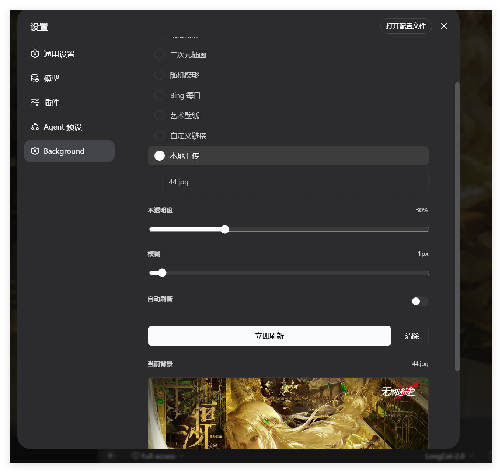
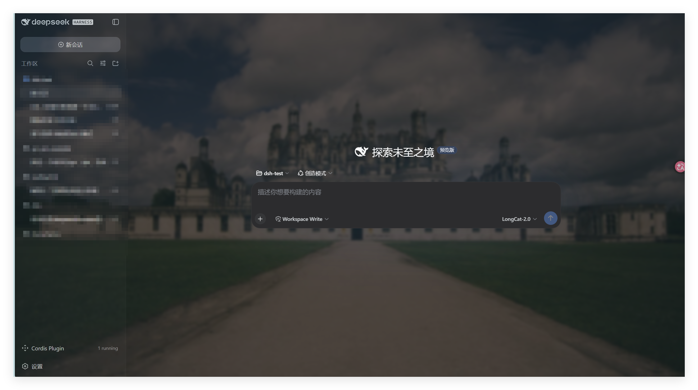
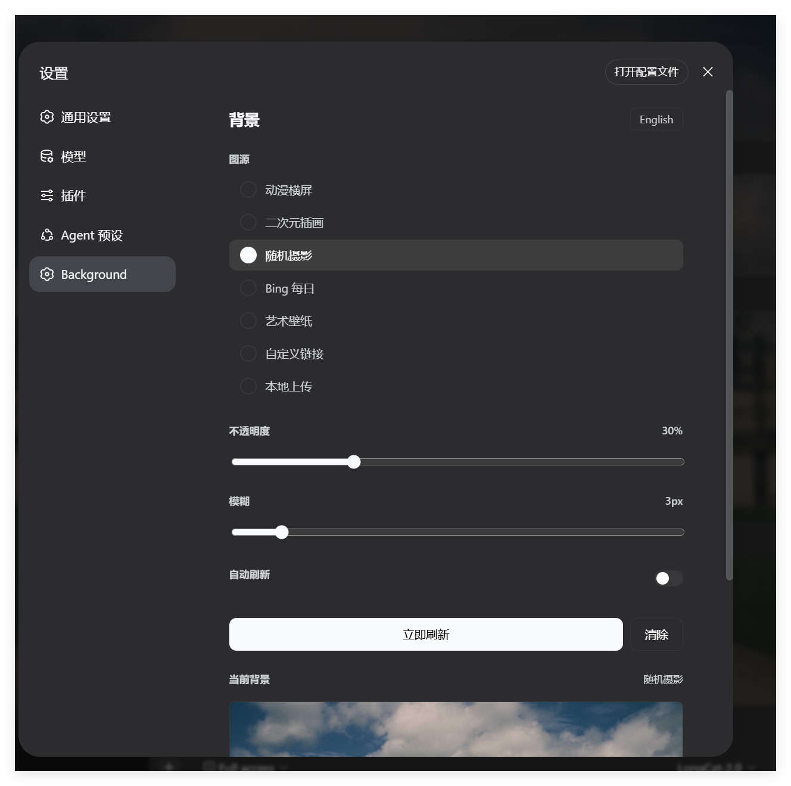

# dsh-bg-image

[](https://www.npmjs.com/package/dsh-bg-image)
[](LICENSE)
[](https://github.com/deepseek-ai/DeepSeek-Harness)

DeepSeek Harness 背景美化插件 — 多图源壁纸、不透明度/模糊调节、毛玻璃效果、localStorage 持久化。

## 预览

| 修改页面 | 美化后 |
|----------|--------|
|  |  |
|  |  |

## 功能

- **7 个图源**：动漫横屏、二次元插画、随机摄影、Bing 每日壁纸、艺术壁纸、自定义 URL、本地上传
- **实时预览**：不透明度与模糊滑块实时生效，无需刷新页面
- **自动持久化**：所有设置保存至 `localStorage`，DSH 重启后自动恢复
- **手动 / 自动刷新**：支持定时自动更换背景
- **零依赖**：纯 Client 端插件，无 Host 半边依赖

## 安装

```sh
dsh plugin --profile <name> add dsh-bg-image
```

## 使用

1. 打开 WebUI → 侧栏「设置」→ 找到 **Background**
2. 选择图源 → 点击 **立即刷新**
3. 拖动「不透明度」和「模糊」滑块调节效果
4. 关闭设置面板后再次进入，设置自动保留

## 图源

| 名称 | 来源 | 内容 |
|------|------|------|
| 动漫横屏 | `loliapi.com/acg/pc/` | 动漫横屏壁纸 |
| 二次元插画 | `api.yujn.cn/api/ecy.php` | 二次元插画图 |
| 随机摄影 | `picsum.photos/1920/1080` | 随机风景摄影 |
| Bing 每日 | `api.yujn.cn/api/bing.php` | Bing 每日壁纸 |
| 艺术壁纸 | `api.yujn.cn/api/heisi.php` | 艺术风格壁纸 |
| 自定义链接 | 直接输入 URL | 任意图片 |
| 本地上传 | 文件选择器 | 本地图像 |

## 持久化与恢复

- 设置保存在浏览器 `localStorage`（键 `dsh-bg-image-settings`），刷新与重启后保留
- DSH 启动时自动恢复上次背景
- 多标签页自动同步

## 卸载

```sh
dsh plugin --profile <name> remove dsh-bg-image
```

## 技术实现

| 能力 | 机制 |
|------|------|
| 背景图层 | 固定定位 DOM 层，`z-index: 1`，位于页面背景之上、内容之下 |
| 不透明度 | CSS `opacity` 实时调节 |
| 模糊 | CSS `filter: blur()` 实时调节 |
| 持久化 | 浏览器 `localStorage`，按 schema 校验 |
| 恢复 | 插件加载时自动应用上次设置 |

## 兼容性

- 支持浅色 / 深色模式
- 支持 `prefers-reduced-motion`
- 不依赖 `backdrop-filter`，无包含块副作用
- 全浏览器兼容（使用 `rgba()` 而非 `color-mix`）

## License

MIT

## 关键词

`dsh`, `cordis`, `plugin`, `background`, `wallpaper`, `beautify`, `anime`, `landscape`, `opacity`, `blur`, `glass`, `deepseek`, `harness`, `ui`, `customization`
